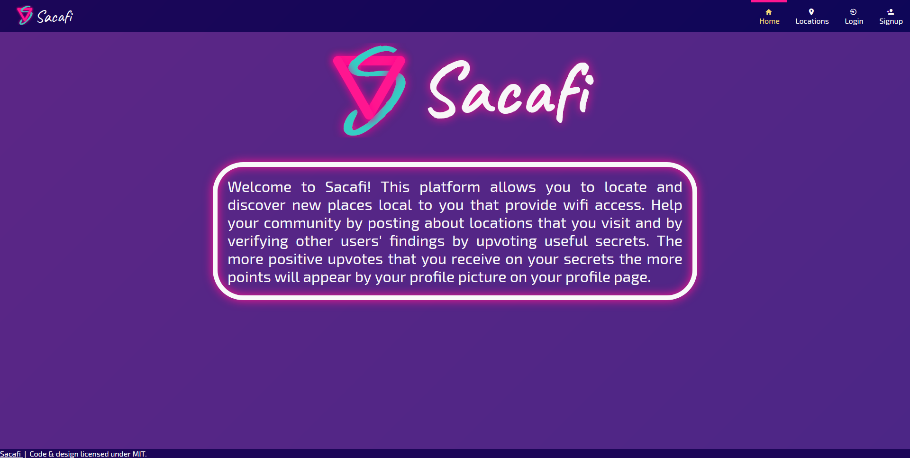
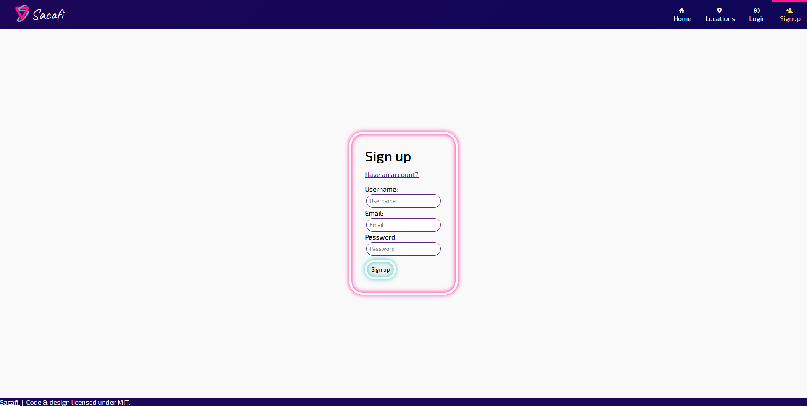
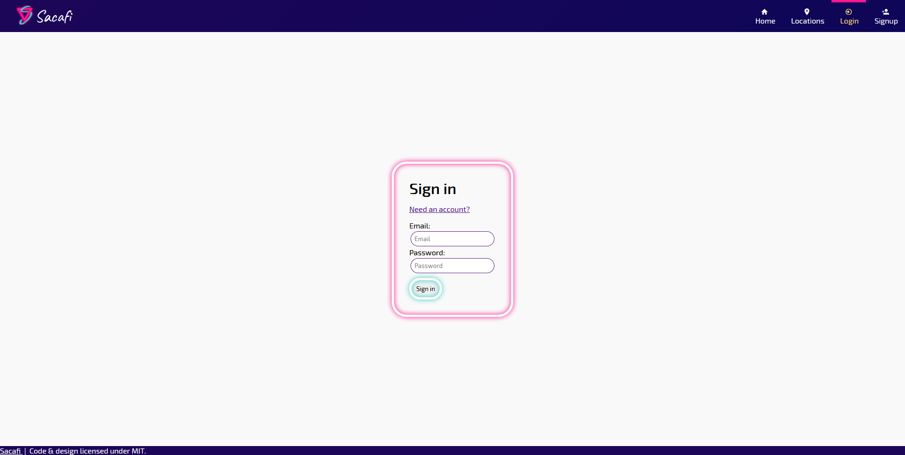
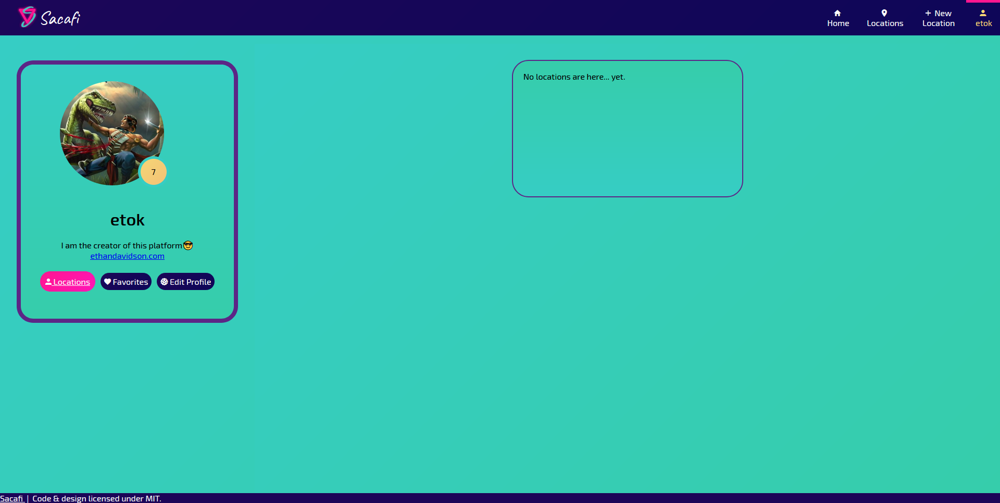
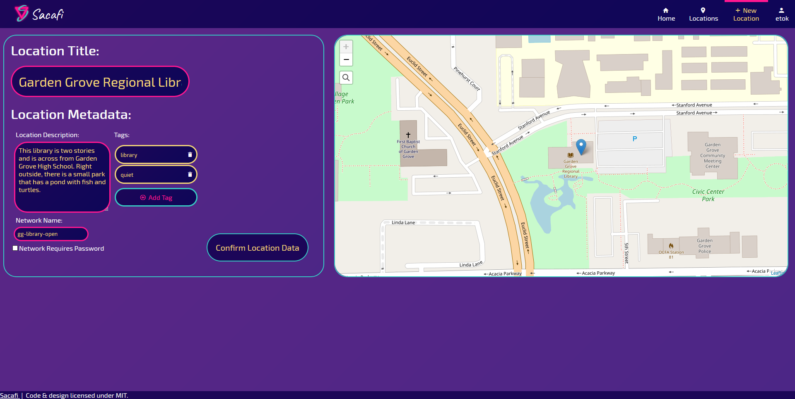
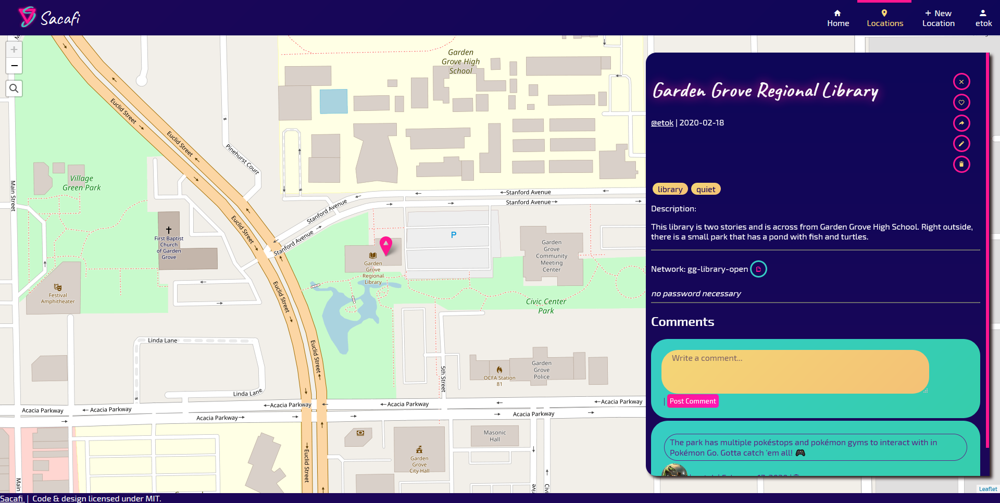
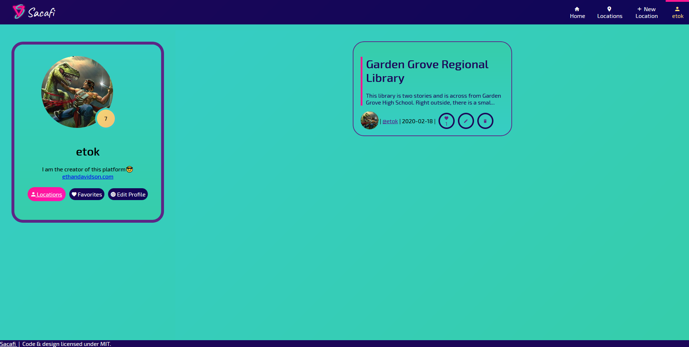
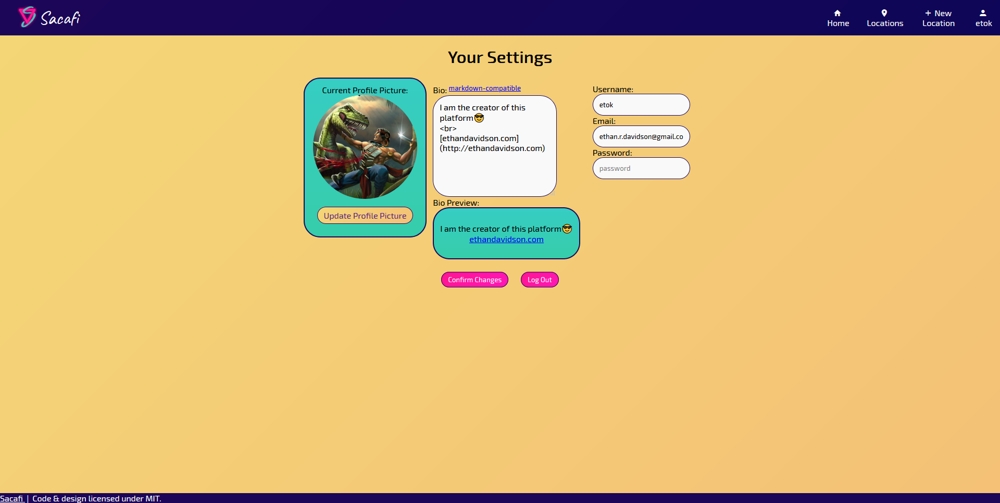

# Sacafi 🥡

## About

The platform for users to post about real-world open wi-fi networks (i.e.: public libraries, cafes, etc) for others to study.

## Screenshots

> Home Page: 

> Sign Up Page: 

> Login Page: 

> Profile Page (empty): 

> New Location: 

> Location Panel: 

> Location Comment: 

> Profile Page: 

> Settings Page: 

## Sacafi Logo

## All Views 👀

- [x] [Locations](frontend/src/views/Locations.vue)
- [x] [Profile](frontend/src/views/Profile.vue)
- [x] [New/Edit Location](frontend/src/views/ArticleEdit.vue)
- [x] [Settings](frontend/src/views/Settings.vue)
- [x] [Home](frontend/src/views/Home.vue)
- [x] [Sign Up](frontend/src/views/Register.vue)
- [x] [Login](frontend/src/views/Login.vue)

## Todo

- [ ] Reorganize and modernize the monorepo into one server-side application.

---

Engineered with 💖 by [EthanThatOneKid](http://ethandavidson.com/)
