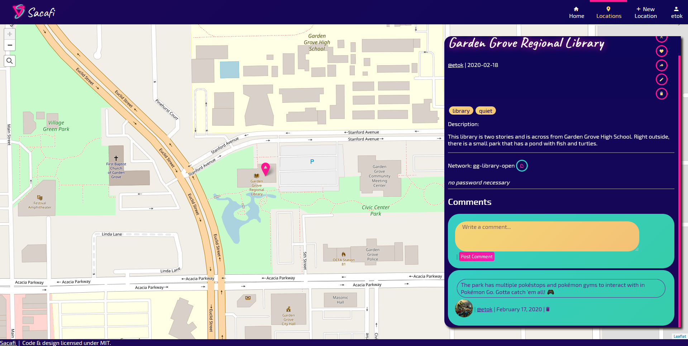

# Sacafi 🥡
> Gimme dat wifi baus!!

## Getting Started (Dev) 🥾
1. Set up .env in backend directory: [see SAMPLE.env](backend/SAMPLE.env)
1. Spin up backend server in backend directory: `npm run dev`
1. Spin up frontend server in frontend directory: `npm run serve`
1. Test in [Postman](https://github.com/gothinkster/realworld/blob/master/api/Conduit.postman_collection.json) and on [localhost](http://localhost:8080)

## Screenshots 📸
> Home Page: 

> Sign Up Page: 

> Login Page: 

> Profile Page (empty): 

> New Location: 

> Location Panel: 

> Location Comment: 

> Profile Page: 

> Settings Page: 

## Designed Veiws 💅
* [x] [Locations](frontend/src/views/Locations.vue)
* [x] [Profile](frontend/src/views/Profile.vue)
* [x] [New/Edit Location](frontend/src/views/ArticleEdit.vue)
* [x] [Settings](frontend/src/views/Settings.vue)
* [x] [Home](frontend/src/views/Home.vue)
* [x] [Sign Up](frontend/src/views/Register.vue)
* [x] [Login](frontend/src/views/Login.vue)

## Known Bugs 🐛
* Various security risks within npm packages.

## Developer Notes 📝
* To add a new property to the Article (location) schema:
    * Add it to `ArticleSchema`'s initialization in [Article.js](backend\models\Article.js).
    * Add it to `ArticleSchema.methods.toJSONFor` (JSON output) in [Article.js](backend\models\Article.js)
    * Make appropriate adjustments where the schema is used, such as in [Article.vue](frontend\src\views\Article.vue), [ArticleEdit.vue](frontend\src\views\ArticleEdit.vue), etc.
* Check out [Ionicons](https://ionicons.com/) to pick out the perfect icon for some element or another.

## Sacafi Logo 🎉

---

Engineered with 💖 by [EthanThatOneKid](http://ethandavidson.com/)